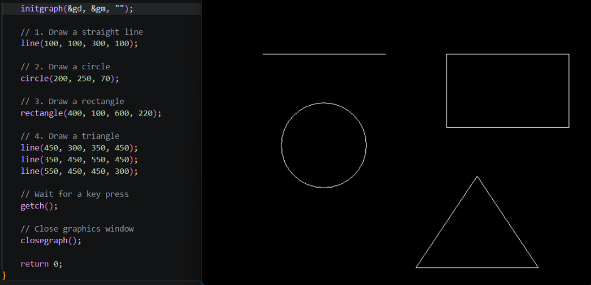

# CGM Lab Assignment 1 - Basic Shapes

## Objective

To understand and implement basic graphics primitives using C++ and the graphics.h library.

## Shapes Drawn

The program draws the following basic graphics primitives

1. Straight Line
2. Circle
3. Rectangle
4. Triangle

# output 



# Graphics library setup 

## Quick setup

```bash
git clone https://github.com/ullaskunder3/graphics.h-project-template.git
```


## My directory look like

```cmd
  D:.
├───.vscode
└───Home
    ├───build
    └───src
```

- Just `Ctrl+Shift+B` to run the build task you will get the executable file in build folder

## !mportant

- Folder `src` contains source code

- Folder `build` where compiler generate .exe

- .vscode contains c_cpp_properties.json and task require modification according to your environment and types compiler
